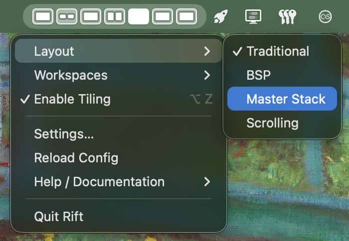

# Rift
  
Rift is a tiling window manager for macOS that focuses on performance and usability. 

  

  

    
    
    
    
  

## Features
- Multiple layout styles
  - Tiling (i3/sway-like)
  - Binary Space Partitioning (bspwm-like)
  - Master-stack (dwm-like)
  - Scrolling columns (niri-style)
- Menubar icon that opens a menu for switching workspaces, changing layouts, and accessing quick Rift controls 
 
click to see the menu bar icon

- MacOS-style mission control that allows you to visually navigate between workspaces 

click to see mission control

- Focus follows the mouse with auto raise
- Drag windows over one another to swap positions
- Performant animations (as seen in the [demo](#rift))
- Switch to next/previous workspace with trackpad gestures (just like native macOS)
- Hot reloadable configuration
- Interop with third-party programs (ie Sketchybar)
  - Requests can be made to rift via the cli or the mach port exposed [(lua client here)](https://github.com/acsandmann/rift.lua)
  - Signals can be sent on startup, workspace switches, and when the windows within a workspace change. These signals can be sent via a command(cli) or through a mach connection
- Does **not** require disabling SIP
- Works with “Displays have separate Spaces” enabled (unlike all other major WMs)

## Quick Start
Get up and running via the wiki:
 

[<kbd> config </kbd>][config_link]

[<kbd> quick start </kbd>][quick_start]
 

## Status
Rift is in active development but is still generally stable. There is no official release yet; expect ongoing changes.

> Issues and PRs are very welcome.

## Community
Join the Rift community on Matrix for discussion, support, and announcements: [#rift:matrix.org](https://matrix.to/#/#rift:matrix.org)

## Motivation
Aerospace worked well for me, but I missed animations and the ability to use fullscreen on one display while working on the other. I also prefer leveraging private/undocumented APIs as they tend to be more reliable (due to the OS being built on them and all the public APIs) and performant.
for more on why rift exists and what rift strives to do, see the [manifesto](manifesto.md)

## Credits
Rift began as a fork (and is licensed as such) of <a href="https://github.com/glide-wm/glide">glide-wm</a> but has since diverged significantly. It uses private APIs reverse engineered by yabai and other projects. It is not affiliated with glide-wm or yabai.

<!---------------------------------------------------------------------------->

[config_link]: https://github.com/acsandmann/rift/wiki/Config
[quick_start]: https://github.com/acsandmann/rift/wiki/Quick-Start
